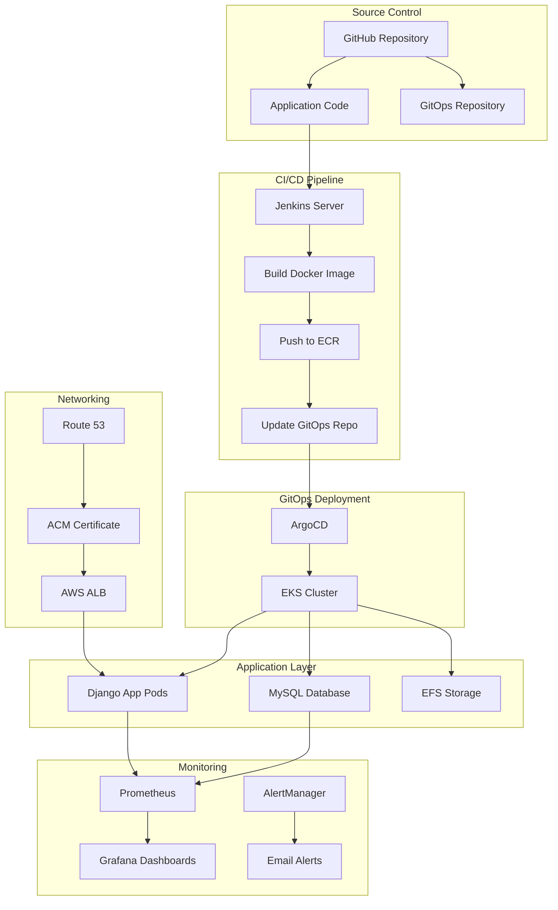

# 🚀 End-to-End DevOps Project on AWS

> A comprehensive DevOps project demonstrating GitOps workflow with Terraform, Kubernetes, Jenkins CI/CD, ArgoCD, and full monitoring stack on AWS.

[](https://www.terraform.io/)
[](https://kubernetes.io/)
[](https://jenkins.io/)
[](https://argoproj.github.io/argo-cd/)
[](https://aws.amazon.com/)
[](https://www.docker.com/)

## 📋 Table of Contents

- [🎯 Project Overview](#-project-overview)
- [🏗️ Architecture](#️-architecture)
- [🛠️ Tech Stack](#️-tech-stack)
- [✨ Key Features](#-key-features)
- [📋 Prerequisites](#-prerequisites)
- [🚀 Quick Start](#-quick-start)
- [📖 Detailed Setup Guide](#-detailed-setup-guide)
- [📊 Monitoring & Alerts](#-monitoring--alerts)
- [🔧 Configuration Files](#-configuration-files)
- [🐛 Troubleshooting](#-troubleshooting)
- [🤝 Contributing](#-contributing)
- [📝 License](#-license)

## 🎯 Project Overview

This project implements a complete **GitOps workflow** on AWS with automated infrastructure provisioning, continuous integration/deployment, and comprehensive monitoring. The application is a Python Django web application with MySQL database, deployed on Amazon EKS with persistent storage using EFS.

### What You'll Learn

- **Infrastructure as Code** with Terraform
- **CI/CD Pipeline** automation with Jenkins
- **GitOps Workflow** using ArgoCD
- **Kubernetes** deployment and management
- **Monitoring** with Prometheus and Grafana
- **AWS Services** integration (EKS, ECR, EFS, ALB, ACM, Route53)

## 🏗️ Architecture



## 🛠️ Tech Stack

### Infrastructure & DevOps
| Technology | Purpose | Version |
|------------|---------|---------|
| **Terraform** | Infrastructure as Code | 1.0+ |
| **AWS EKS** | Kubernetes cluster | 1.24+ |
| **AWS ECR** | Container registry | - |
| **AWS EFS** | Persistent storage | - |
| **AWS ALB** | Load balancer | - |
| **AWS ACM** | SSL certificates | - |
| **Route 53** | DNS management | - |

### CI/CD & GitOps
| Technology | Purpose | Version |
|------------|---------|---------|
| **Jenkins** | CI/CD pipeline | 2.375+ |
| **ArgoCD** | GitOps deployment | 2.5+ |
| **Docker** | Containerization | 20.0+ |
| **GitHub** | Source code & GitOps repo | - |

### Monitoring & Observability
| Technology | Purpose | Version |
|------------|---------|---------|
| **Prometheus** | Metrics collection | 2.40+ |
| **Grafana** | Visualization & dashboards | 9.0+ |
| **AlertManager** | Alert management | 0.24+ |

### Application
| Technology | Purpose | Version |
|------------|---------|---------|
| **Python Django** | Web application | 4.0+ |
| **MySQL** | Database | 8.0+ |
| **Kubernetes** | Container orchestration | 1.24+ |

## ✨ Key Features

- 🔄 **Automated CI/CD Pipeline** - Jenkins builds, tests, and deploys on every commit
- 🎯 **GitOps Workflow** - ArgoCD automatically syncs Kubernetes manifests from Git
- 🏗️ **Infrastructure as Code** - Complete AWS infrastructure managed with Terraform
- 📊 **Comprehensive Monitoring** - Prometheus metrics with Grafana dashboards
- 🔒 **Security First** - RBAC, secrets management, and network security groups
- 📈 **Scalable Architecture** - Kubernetes with auto-scaling and load balancing
- 💾 **Persistent Storage** - EFS-backed storage for database and application data
- 🌐 **Production Ready** - SSL termination, custom domain, and high availability

## 📋 Prerequisites

### Required Software
- [Terraform](https://www.terraform.io/downloads.html) (v1.0+)
- [AWS CLI](https://aws.amazon.com/cli/) (v2.0+)
- [kubectl](https://kubernetes.io/docs/tasks/tools/) (v1.24+)
- [Docker](https://www.docker.com/products/docker-desktop/) (v20.0+)
- [Git](https://git-scm.com/downloads) (v2.30+)

### AWS Account Requirements
- ✅ AWS account with appropriate permissions
- ✅ S3 bucket for Terraform backend (create manually first)
- ✅ Domain name for Route 53 (optional but recommended)

### GitHub Requirements
- ✅ GitHub account
- ✅ Personal access token with repo permissions
- ✅ Two repositories:
  - Main application repository
  - GitOps repository for Kubernetes manifests

## 🚀 Quick Start

### 1. Clone the Repository
```bash
git clone https://github.com/yourusername/end-to-end-devops.git
cd end-to-end-devops
```

### 2. Configure AWS Credentials
```bash
aws configure
# Enter your AWS Access Key ID, Secret Access Key, and default region (ap-southeast-1)
```

### 3. Create S3 Backend Bucket
```bash
aws s3 mb s3://terraform-devops-backend-file --region ap-southeast-1
```

### 4. Deploy Infrastructure
```bash
cd terraform
terraform init
terraform plan
terraform apply -auto-approve
```

### 5. Configure Jenkins & ArgoCD
Follow the detailed setup guide below for complete configuration.

## 📖 Detailed Setup Guide

### Phase 1: Infrastructure Setup

#### Step 1: Configure Terraform Backend
1. Update the S3 bucket name in `terraform/provider.tf`:
```hcl
terraform {
    backend "s3" {
        bucket = "your-terraform-backend-bucket"
        region = "ap-southeast-1"
        key = "terraform.tfstate"
        encrypt = true
        use_lockfile = true
    }
}
```

#### Step 2: Deploy AWS Infrastructure
```bash
cd terraform
terraform init
terraform plan
terraform apply -auto-approve
```

This will create:
- ✅ VPC with public/private subnets
- ✅ EKS cluster
- ✅ ECR repository
- ✅ EFS file system
- ✅ EC2 instance for Jenkins
- ✅ Route 53 hosted zone
- ✅ ACM certificate

#### Step 3: Configure kubectl
```bash
aws eks update-kubeconfig --region ap-southeast-1 --name your-eks-cluster-name
kubectl get nodes
```

### Phase 2: Jenkins Setup

#### Step 1: Connect to Jenkins Server
```bash
# Get the public IP of your Jenkins EC2 instance
aws ec2 describe-instances \
  --filters "Name=tag:Name,Values=Jenkins-Server" \
  --query 'Reservations[].Instances[].PublicIpAddress' \
  --output text

# SSH to the server
ssh -i your-key.pem ubuntu@<jenkins-public-ip>
```

#### Step 2: Install Jenkins
Follow the installation guide in `Install-and-Configuration/Jenkins, Docker and AWS CLi installation.txt`

#### Step 3: Configure Jenkins Credentials
1. Access Jenkins UI (http://jenkins-public-ip:8080)
2. Add GitHub token as credential:
   - Go to **Manage Jenkins** > **Credentials** > **System** > **Global credentials**
   - Add new credential:
     - **Kind**: Secret text
     - **ID**: `GITHUB_TOKEN`
     - **Secret**: Your GitHub personal access token

#### Step 4: Create Jenkins Pipeline
1. Create new Pipeline job
2. Configure webhook trigger from GitHub
3. Use the Jenkinsfile from `jenkins-cicd/Jenkinsfile`

### Phase 3: ArgoCD Setup

#### Step 1: Install ArgoCD
```bash
kubectl create namespace argocd
kubectl apply -n argocd -f https://raw.githubusercontent.com/argoproj/argo-cd/stable/manifests/install.yaml
```

#### Step 2: Access ArgoCD UI
```bash
kubectl port-forward svc/argocd-server -n argocd 8080:443
# Access https://localhost:8080
# Default username: admin
# Get password: kubectl -n argocd get secret argocd-initial-admin-secret -o jsonpath="{.data.password}" | base64 -d
```

#### Step 3: Create ArgoCD Application
1. Create application pointing to your GitOps repository
2. Set path to `Kubernetes-with-ArgoCD/`
3. Enable auto-sync

### Phase 4: Application Deployment

#### Step 1: Update Configuration
1. Update image references in Kubernetes manifests
2. Configure database credentials in secrets
3. Update domain name in ingress configuration

#### Step 2: Deploy Application
```bash
kubectl apply -f "Kubernetes-with-ArgoCD/"
```

### Phase 5: Monitoring Setup

#### Step 1: Install Prometheus
```bash
kubectl create namespace monitoring
kubectl apply -f "Install-and-Configuration/prometheus yml file.txt"
```

#### Step 2: Install Grafana
```bash
kubectl apply -f "Install-and-Configuration/Grafana installation.txt"
```

#### Step 3: Configure Dashboards
1. Access Grafana (port-forward or ingress)
2. Import Prometheus as data source
3. Import monitoring dashboards

## 📊 Monitoring & Alerts

### Prometheus Configuration
- 📈 Metrics collection from Kubernetes pods
- 🔍 Custom metrics for application health
- ⚠️ Alert rules for critical failures

### Grafana Dashboards
- 🏗️ Kubernetes cluster overview
- 📊 Application performance metrics
- 🗄️ Database monitoring
- 🔄 Jenkins pipeline status

### Alert Configuration
- 📧 Email alerts for pipeline failures
- 🏥 Service health monitoring
- 💾 Resource utilization alerts

## 🔧 Configuration Files

### Project Structure
```
end-to-end-devops/
├── 📁 terraform/                 # Infrastructure as Code
│   ├── 📁 ec2/                  # EC2 instance configuration
│   ├── 📁 eks/                  # EKS cluster setup
│   ├── 📁 ecr/                  # ECR repository
│   ├── 📁 efs/                  # EFS file system
│   └── 📁 vpc/                  # VPC and networking
├── 📁 jenkins-cicd/             # CI/CD pipeline
│   ├── 📁 app/                  # Django application
│   └── 📄 Jenkinsfile           # Jenkins pipeline definition
├── 📁 Kubernetes-with-ArgoCD/   # Kubernetes manifests
├── 📁 Install-and-Configuration/ # Setup scripts and configs
└── 📁 Other-service/            # Additional services
```

### Key Configuration Files:
- `terraform/` - Infrastructure as Code
- `jenkins-cicd/Jenkinsfile` - CI/CD pipeline
- `Kubernetes-with-ArgoCD/` - Kubernetes manifests
- `Install-and-Configuration/` - Setup scripts and configs

### Environment Variables:
```bash
export AWS_REGION=ap-southeast-1
export AWS_ACCOUNT_ID=your-account-id
export GITHUB_TOKEN=your-github-token
```

## 🐛 Troubleshooting

### Common Issues & Solutions

#### 1. Terraform Backend Issues
```bash
# If S3 backend doesn't exist
aws s3 mb s3://terraform-devops-backend-file --region ap-southeast-1

# If backend configuration is incorrect
terraform init -reconfigure
```

#### 2. EKS Connection Issues
```bash
# Update kubeconfig
aws eks update-kubeconfig --region ap-southeast-1 --name your-cluster-name

# Verify cluster access
kubectl get nodes
```

#### 3. Jenkins Pipeline Failures
- ✅ Check GitHub token permissions
- ✅ Verify ECR repository access
- ✅ Ensure Docker is running on Jenkins server
- ✅ Check Jenkins logs: `sudo journalctl -u jenkins -f`

#### 4. ArgoCD Sync Issues
- ✅ Verify GitOps repository access
- ✅ Check Kubernetes manifest syntax
- ✅ Review ArgoCD application logs: `kubectl logs -n argocd deployment/argocd-server`

#### 5. Application Deployment Issues
```bash
# Check pod status
kubectl get pods -n default

# Check pod logs
kubectl logs <pod-name>

# Check events
kubectl get events --sort-by='.lastTimestamp'

# Describe pod for detailed info
kubectl describe pod <pod-name>
```

### Useful Commands

#### AWS Services
```bash
# Check EKS cluster status
aws eks describe-cluster --name your-cluster-name --region ap-southeast-1

# List ECR repositories
aws ecr describe-repositories --region ap-southeast-1

# Check EFS mount targets
aws efs describe-mount-targets --file-system-id your-efs-id
```

#### Kubernetes
```bash
# Check all resources
kubectl get all --all-namespaces

# Check ArgoCD application status
kubectl get applications -n argocd

# Port forward services
kubectl port-forward svc/argocd-server -n argocd 8080:443
```

#### Jenkins
```bash
# Monitor Jenkins logs
sudo journalctl -u jenkins -f

# Check Jenkins status
sudo systemctl status jenkins
```

## 🤝 Contributing

We welcome contributions! Please follow these steps:

1. 🍴 Fork the repository
2. 🌿 Create a feature branch (`git checkout -b feature/amazing-feature`)
3. 💾 Commit your changes (`git commit -m 'Add amazing feature'`)
4. 🚀 Push to the branch (`git push origin feature/amazing-feature`)
5. 📝 Open a Pull Request

### Contribution Guidelines
- 🔍 Test your changes thoroughly
- 📝 Update documentation as needed
- 🎯 Follow existing code style
- ✅ Ensure all tests pass

## 📝 License

This project is licensed under the MIT License - see the [LICENSE](LICENSE) file for details.

## 📞 Support

For support and questions:
- 🐛 Create an issue in the GitHub repository
- 🔍 Check the troubleshooting section above
- 📚 Review the configuration files for reference
- 💬 Join our community discussions

---

## ⚠️ Important Notes

> **Production Use**: This project is for educational and demonstration purposes. Please review and modify configurations according to your specific requirements and security policies before using in production environments.

> **Security**: Always use strong passwords, rotate credentials regularly, and follow AWS security best practices.

> **Costs**: Be aware of AWS costs associated with running this infrastructure. Consider using AWS Free Tier for learning purposes.

---

**Made with ❤️ for the DevOps community**
